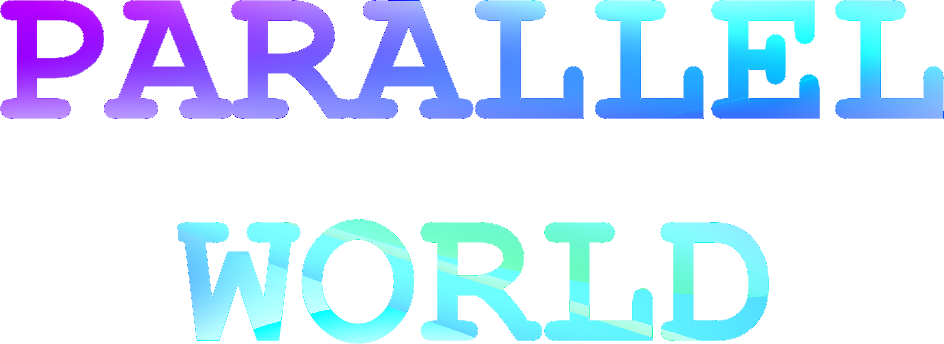

<p align="center">
  
</p>

<p align="center">
  <b>日本語</b> | <a href="README.en.md">English</a>
</p>

# Parallel World

Parallel Worldは、Live2Dまたは静止画のキャラクターとテキスト・音声で会話できる、ローカル優先のデスクトップAIコンパニオンです。

## アプリ紹介

会話、キャラクター、音声、履歴、記憶を一つのアプリにまとめています。LLM・音声認識・音声合成・キャラクター表示はそれぞれ独立しているため、外部サービスが停止していても、影響する機能だけを無効にしてアプリを起動できます。

- **ローカル優先** — LLMとTTSの既定接続先はloopback（自分のPC内）です。LANやクラウドへの接続は、設定画面で明示的に許可した場合だけ有効になります。
- **キャラクター表示** — Live2Dモデル、または静止画キャラクターを表示します。読み上げに合わせて口や表情が動きます。
- **テキストと音声の両方で会話** — キーボード入力に加え、ローカルの音声認識（Silero VAD + ReazonSpeech）で話しかけられます。
- **記憶と履歴** — 会話履歴・要約・型付き記憶をSQLiteに保存します。Memory Centerから確認・検索・削除ができます。
- **選べる接続先** — LLMはOpenAI互換API、OpenAI、Google Gemini、OpenCode Zenから選択できます。APIキーはOSの資格情報ストアに保存します。

> 現在は開発版です。一般配布用の署名・updater・モデル配布と、自発発話ランタイムは開発中です。

## 動作要件

| 項目 | 要件 |
| --- | --- |
| OS | Windows 10 / 11（x86_64）、または現在サポートされているmacOS |
| ディスク空き容量 | 20GB程度を推奨（内訳の目安: C++ Build Toolsで数GB、Rustツールチェーンと`target/`で数GB、JavaScript依存で数百MB） |
| 追加の空き容量 | 音声認識モデルを使う場合は約0.7GB、Irodori-TTSのmanaged環境を使う場合はさらに15GB以上を推奨 |
| GPU | 必須ではありません。Irodori-TTSはNVIDIA GPUを検出した場合CUDA（cu128）、それ以外はCPUで動作します |
| メモリ | アプリ本体は一般的なデスクトップPCで動作します。同じPCでLLMを動かす場合は、そのモデルが要求するメモリ・VRAMが別途必要です |
| ネットワーク | 初回セットアップ時のみ必要です。以降はクラウドLLMを選ばない限りローカルだけで動作します |

## Windowsのセットアップ

### 1. リポジトリを取得

```powershell
git clone https://github.com/mistraparutenaste/Parallel-World-AIPartner.git
```

### 2. ランチャーを実行

取得したフォルダ内の **`ParallelWorld_run.bat` をダブルクリック** します。以降は画面の指示に従うだけで、次の処理が順に行われます。

1. 不足している開発環境（Node.js、Rust、C++ Build Tools、WebView2 Runtime）を検出して導入
2. JavaScript依存関係の導入とワークスペースのビルド
3. 利用可能なキャラクターアセットの同期
4. frontendのtypecheckとRustの`cargo check`
5. TTSの準備とアプリの起動

大きなダウンロードの前には、必ず英語の`y/n`確認が表示されます。任意の音声認識モデルを断ってもテキスト会話は利用できます。必須のコンパイラやランタイムを断った場合は、理由を表示して停止します。

途中で失敗しても、もう一度ダブルクリックすれば再開できます。完了済みの手順とダウンロード済みファイルは再利用されます。

### 3. AIと音声を設定

起動後、設定画面で接続先を指定します。

| 種別 | 既定値 | 補足 |
| --- | --- | --- |
| LLM | `http://127.0.0.1:8080/v1` | 「AI」画面でローカル / LAN、OpenAI、Google Gemini、OpenCode Zen、カスタムを選択できます |
| AivisSpeech | `http://127.0.0.1:10101` | `ParallelWorld_run.bat`が既定で起動を試みるTTSです |
| Irodori-TTS | `http://127.0.0.1:8088` | `ParallelWorld_run.bat`実行前に`set PW_TTS_ENGINE=irodori`を指定した場合に使用します |

LM Studioなどを既定と違うポートで動かしている場合は、実際の接続先をアプリ側にも保存してください。

Irodori-TTSを使う場合、初回は約2.4GBの直接ダウンロードに加えてPython環境の構築が発生します。詳細は[Irodori-TTSセットアップ](docs/setup/irodori-tts.md)を参照してください。

### キャラクターについて

Live2Dのサンプルモデルは利用規約により再配布できないため、クローン直後のリポジトリには含まれていません。ランチャーはその旨を表示して処理を続行し、アプリはキャラクター無しで起動します。起動後に設定画面からLive2Dモデルまたは静止画を追加してください。開発用モデルを手動で配置する場合は[project-input/live2d/SOURCE_URLS.md](project-input/live2d/SOURCE_URLS.md)を参照してください。

<details>
<summary>ランチャーを使わず手動でセットアップする場合</summary>

あらかじめGit、Node.js 24.15.0以上、Rust 1.96.0、Visual Studio Build Tools（C++によるデスクトップ開発ワークロード）、Microsoft Edge WebView2 Runtimeを導入した上で、PowerShellで次を実行します。

```powershell
git clone https://github.com/mistraparutenaste/Parallel-World-AIPartner.git
Set-Location Parallel-World-AIPartner
corepack enable pnpm
corepack pnpm install --frozen-lockfile
corepack pnpm build
```

`corepack pnpm build`では、アプリが参照するLive2D runtimeの`dist`も生成します。

任意のモデルは次のコマンドで配置します。どちらも未配置のまま起動でき、テキスト会話と静止画キャラクターは利用できます。

```powershell
node tools/scripts/download-stt-models.mjs
node tools/scripts/sync-live2d-dev-assets.mjs
```

起動方法は用途に応じて選択します。

| 起動方法 | 用途 |
| --- | --- |
| `corepack pnpm --filter @parallel-world/desktop tauri dev` | 通常の開発起動 |
| `powershell -ExecutionPolicy Bypass -File tools/scripts/dev-up.ps1` | AivisSpeech、LLM、開発用アセットを確認してから起動 |
| `ParallelWorld_run.bat` | 環境準備から検証、起動までを一括実行 |

</details>

## macOSのセットアップ

### 1. リポジトリを取得

```bash
git clone https://github.com/mistraparutenaste/Parallel-World-AIPartner.git
```

### 2. ランチャーを実行

Finderでリポジトリを開き、**`ParallelWorld_run.command` をダブルクリック** します。Finderに実行を拒否された場合は、Terminalで次を一度だけ実行してから再試行してください。

```bash
chmod +x ParallelWorld_run.command
```

Terminalから直接起動する場合は、リポジトリのルートで次を実行します。

```bash
./ParallelWorld_run.command
```

ランチャーはXcode Command Line Tools、Homebrew、Node.js、Rustの不足分を確認し、依存関係の導入、frontendのtypecheck、Rustの`cargo check`を行ってからアプリを起動します。Windowsと同じく、大きなダウンロードの前には`y/n`確認が表示されます。

macOSではTTSサーバーを自動起動しません。managed Irodori環境の準備を承諾した場合のみ、`http://127.0.0.1:8088`のIrodori-TTSを起動します。それ以外の場合は、設定画面で外部TTSの接続先を指定してください。

> macOSランチャーは静的チェック済みですが、実機のFinderからの起動は未検証です。

<details>
<summary>ランチャーを使わず手動でセットアップする場合</summary>

Xcode Command Line Toolsが未導入の場合は、先に次を実行します。

```bash
xcode-select --install
```

続いて依存関係を準備します。

```bash
git clone https://github.com/mistraparutenaste/Parallel-World-AIPartner.git
cd Parallel-World-AIPartner
corepack enable pnpm
corepack pnpm install --frozen-lockfile
corepack pnpm build
chmod +x ParallelWorld_run.command
```

音声入力または開発用Live2Dモデルを使う場合は、Windowsと同じNode.jsスクリプトを実行します。

```bash
node tools/scripts/download-stt-models.mjs
node tools/scripts/sync-live2d-dev-assets.mjs
```

</details>

## うまく動かないとき

| 症状 | 対処 |
| --- | --- |
| ランチャーが「コマンドが見つかりません」で止まる | 直前に導入したツールのPATHが反映されていない可能性があります。ランチャーを一度閉じてから再実行してください。それでも解決しない場合はPCを再起動します |
| キャラクターが表示されない | 仕様どおりの初期状態です。Live2Dサンプルモデルは同梱していないため、設定画面からLive2Dモデルまたは静止画を追加してください |
| 返答が生成されない | LLMサーバーが起動していません。LM Studioなどを起動し、設定画面の接続先（既定`http://127.0.0.1:8080/v1`）が実際のポートと一致しているか確認してください。`dev-up.ps1`が疎通確認に使う既定ポートは`1234`です |
| 読み上げが鳴らない | AivisSpeechが起動していません。手動で起動するか、実行ファイルの場所を`PW_AIVIS_ENGINE`環境変数で指定してください。TTSが無くてもテキスト会話は利用できます |
| 音声入力が反応しない | 音声認識モデルが未配置です。`node tools/scripts/download-stt-models.mjs`を実行してください（約0.7GB） |
| Irodori-TTSを使いたい | ランチャー実行前に`set PW_TTS_ENGINE=irodori`（PowerShellでは`$env:PW_TTS_ENGINE='irodori'`）を指定してください |
| macOSでランチャーが開けない | Terminalで`chmod +x ParallelWorld_run.command`を実行してから再試行してください |

解決しない場合は、[開発環境セットアップ](docs/development/getting-started.md)に詳細な手順があります。

## 技術面説明

### リポジトリ構成

```text
Parallel-World-AIPartner/
├─ apps/
│  └─ desktop/               React UIとTauriデスクトップアプリ
├─ crates/
│  ├─ pw-application/        ユースケースとアプリケーション制御
│  ├─ pw-audio/              音声入出力と再生処理
│  ├─ pw-contracts/          Rust / TypeScript間のIPC契約
│  ├─ pw-domain/             会話、記憶、キャラクターのドメインモデル
│  ├─ pw-llm/                LLM providerとストリーミング応答
│  ├─ pw-platform/           OS機能と資格情報ストア
│  ├─ pw-storage/            SQLite永続化
│  ├─ pw-stt-sherpa/         ローカル音声認識
│  └─ pw-tts/                音声合成providerと再生キュー
├─ packages/
│  ├─ contracts/             生成されたTypeScript IPC型
│  └─ live2d-runtime/        Live2D runtimeラッパー
├─ tools/scripts/            セットアップ、起動、配布検証スクリプト
├─ docs/                     設計、開発、検証ドキュメント
├─ assets/                   ブランドアセット
└─ project-input/            開発用入力資料とサンプル
```

### 独自実装技術

#### ローカル優先の縮退動作

LLM、STT、TTS、キャラクター表示を分離し、一部の外部サービスが停止してもアプリ全体は停止しない構成です。LLMとTTSの既定接続先はloopbackで、LANやクラウドへの接続には設定での明示許可が必要です。

#### 型付きIPCとCapability境界

Rust DTOからTypeScript bindingsを生成し、schema version付きのIPC契約として管理しています。生PCM、SQLite、モデル、任意ファイルアクセスはWebViewへ直接渡さず、Rust側の検証済みDTOとwindow単位のCapability境界を通します。

```powershell
cargo run -p pw-contracts --bin export-bindings
```

#### 人間らしい対話と記憶

SQLiteの会話履歴と要約に加え、型付き記憶、対話状態、約束状態を分離して保存します。Memory Centerでは、保存された記憶の確認、検索、削除が可能です。プロンプト用記憶・要約・技術ログの境界では、秘密情報らしい内容をマスクします。

#### キャラクター連動の音声パイプライン

ストリーミング応答を文章単位に分割し、TTSキュー、再生開始イベント、Live2Dまたは静止画キャラクターの状態変化を連動させます。生成中と読み上げ中の処理は、セーフワードや停止操作で即時に中断できます。

#### OS資格情報ストア

クラウドLLMのAPIキーは設定JSONやIPCへ含めず、OSの資格情報ストアに保存します。WindowsではCredential Managerを使用します。

### 使用技術

| 分野 | 使用技術 |
| --- | --- |
| デスクトップ | Tauri 2 |
| frontend | React 19、TypeScript 7、Vite 8 |
| backend | Rust 2024 Edition、Tokio |
| データベース | SQLite、rusqlite |
| IPC型生成 | serde、ts-rs |
| LLM | OpenAI互換Chat Completions API、reqwest |
| 音声入力 | cpal、Silero VAD、sherpa-onnx、ReazonSpeech |
| 音声合成 | AivisSpeech、Irodori-TTS |
| キャラクター | Live2D Cubism SDK、静止画renderer |
| 資格情報 | keyring |
| frontend test | Vitest、Testing Library、jsdom |
| Rust品質管理 | rustfmt、Clippy、Cargo test |

### 開発ツールのバージョン

| ツール | バージョン・要件 |
| --- | --- |
| Node.js | 24.15.0以上 |
| pnpm | 11.11.0（`package.json`で固定） |
| Rust | 1.96.0（`rust-toolchain.toml`で固定） |
| Tauri CLI | 2.11.4 |
| Windows | Visual Studio Build Tools、WebView2 Runtime |
| macOS | Xcode Command Line Tools |

### 対応する外部サービス

すべて必須ではありません。未接続の機能は縮退動作になり、利用可能な機能だけでアプリを起動します。

| 用途 | 対応サービス |
| --- | --- |
| LLM | OpenAI互換Chat Completions API、OpenAI、Google Gemini、OpenCode Zen |
| 音声認識 | Silero VAD、ReazonSpeech |
| 音声合成 | AivisSpeech、Irodori-TTS |
| キャラクター | Live2Dモデル、または静止画 |

Responses API専用モデルには未対応です。クラウド接続はユーザーが明示的に選択した場合だけ有効になります。

### 主な開発チェック

```powershell
corepack pnpm build
corepack pnpm typecheck
corepack pnpm test
cargo fmt --all --check
cargo clippy --workspace --all-targets --all-features -- -D warnings
cargo test --workspace
corepack pnpm distribution:verify
```

ローカル開発用bundleは次のコマンドで生成できます。一般公開用の署名・updater付きreleaseではありません。

```powershell
corepack pnpm bundle:windows:local
corepack pnpm bundle:macos:local
```

### 関連ドキュメント

- [開発環境セットアップ](docs/development/getting-started.md)
- [人間らしい対話エージェントの境界](docs/architecture/human-like-agent.md)
- [Phase 6受け入れ検証](docs/development/phase6-acceptance.md)
- [Phase 7配布計画](docs/superpowers/plans/2026-07-13-phase-7-distribution.md)
- [静止画キャラクタープロファイル](project-input/static-character/README.md)

## ライセンス関係

Parallel Worldはデュアルライセンスです。

- **非商用利用**: [PolyForm Noncommercial License 1.0.0](LICENSE)に基づき許諾します。個人的な学習、趣味、研究、非営利団体や教育機関での利用などが該当します。追加の手続きは不要です。
- **商用利用**: 上記ライセンスの許諾範囲外です。著作権者との個別の商用ライセンス契約が必要です。条件と問い合わせ先は[LICENSE-COMMERCIAL.md](LICENSE-COMMERCIAL.md)を参照してください。

PolyForm Noncommercial LicenseはOSI承認のオープンソースライセンスではありません。頒布する場合は、[LICENSE](LICENSE)またはそのURLと、`Required Notice:`で始まる行を必ず一緒に渡してください。

このライセンスが対象とするのは、著作権者が本リポジトリにおいて権利を有する著作物のみです。Live2D SDK、VAD / STTモデル、LLM、AivisSpeech、Irodori-TTS、フォント、キャラクター画像には、それぞれ異なる利用条件があり、商用ライセンスの対象にも含まれません。特にLive2D Cubism SDKは、直近会計年度の売上高が1000万円以上の事業者が利用する場合、Live2D社のリリースライセンスへの同意が別途必要です。詳細は[THIRD-PARTY-NOTICES.md](THIRD-PARTY-NOTICES.md)を参照してください。キャラクターのモデルと画像はGitおよび配布bundleには含めません。

コントリビューションを受け付ける際の権利の扱いは[CONTRIBUTING.md](CONTRIBUTING.md)に定めます。

標準UIフォントには[ラノベPOP v2](https://flopdesign.booth.pm/)を使用しています。同梱の説明書は[こちら](apps/desktop/src/assets/fonts/lanobe-pop-v2/ReadMe.html)です。

- Copyright (C) 2002-2019 M+ FONTS PROJECT
- Copyright (C) 2020 flopdesign.com
- Copyright (C) 2020 Kato Masashi
