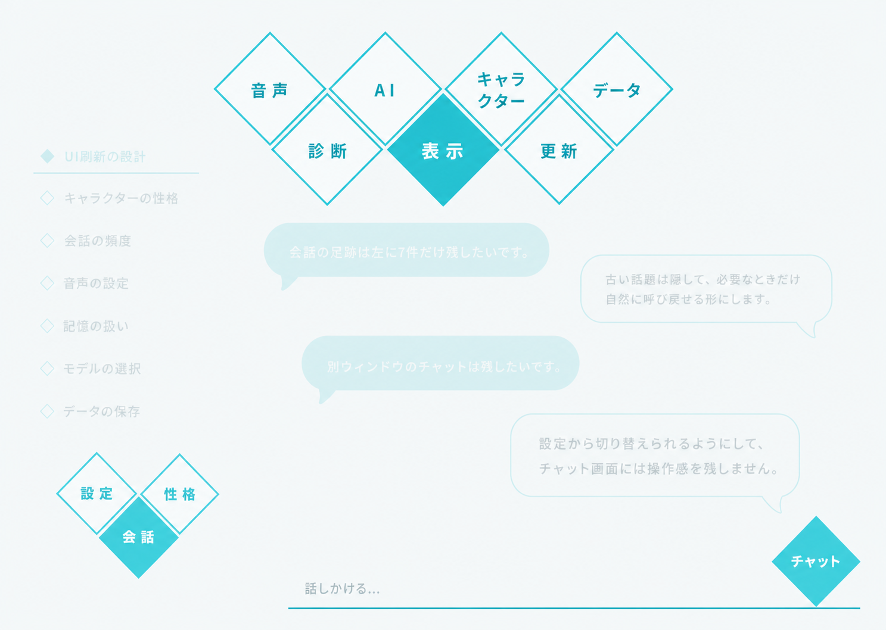
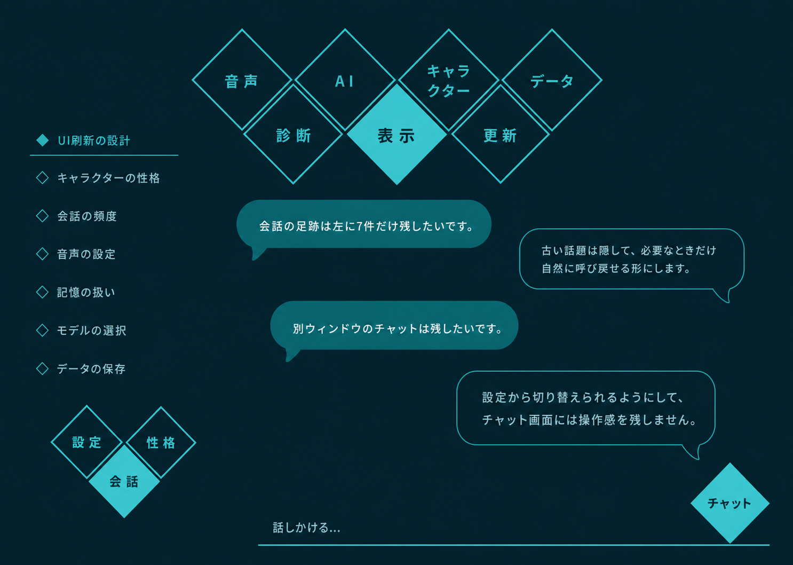

# 会話中心UI刷新設計

**日付:** 2026-07-16<br>
**状態:** 基本設計確定・今回スコープ実装済み<br>
**対象:** Parallel World デスクトップUI<br>
**基準テーマ:** ライトテーマ、および選定済みダークテーマ<br>

本書は、会話を中心とした新しいUIの設計判断をまとめる。UIシェルに関して本書と次の既存設計が競合する場合は、本書を優先する。

- `2026-07-14-control-center-ui-design.md`
- `2026-07-16-game-settings-ui-design.md`

性格モデルへのサディズム追加は、`2026-07-16-personality-sadism-extension-design.md`を参照する。

2026-07-17に実装開始の承認を得た。本書と採用モックを視覚・挙動の基準とし、会話中心シェル、会話設定、性格、サディズム、セーフワードまでを復旧可能な縦切りとして実装した。

## 1. プロダクト思想

Parallel Worldは、AIを操作するプログラムではなく、人間らしいAIパートナーと自然に過ごすためのアプリケーションとして設計する。

- 「タスク」「スレッド」「完了」「再開」などの作業管理語を会話画面へ出さない。
- 話題の分割、要約、アーカイブ、コンテキスト制御は裏側で行う。
- ユーザーに見せるのは管理構造ではなく、会話の自然な「足跡」とする。
- カード、サイドバー、常設ツールバー、技術ステータスを増やさない。
- 視線の中心は常に現在の会話とAIパートナーに置く。

## 2. ビジュアル言語

参考画像の次の特徴を継承する。

- 白を基調とした広い余白
- シアンの細線と塗り
- 45度回転したひし形
- 大きな角丸としっぽを持つ吹き出し
- 幾何学形状による、軽く感情的な画面構成
- 影や立体感に頼らないフラットな階層

基準トークンは既存のDiamond-popデザインシステムを引き継ぐ。

| 用途 | 値 |
| --- | --- |
| アクセント | `#23C4D8` |
| 強いアクセント | `#0C92A6` |
| 淡いアクセント | `#E0F9FC` |
| 本文 | `#12333C` |
| 補助文字 | `#58787F` |
| 基本面 | 白またはごく淡いシアン |
| 日本語フォント | Hiragino Sans / Yu Gothic UI / Noto Sans JP系 |

## 3. 画面全体の構成

- 従来のサイドバーは廃止する。
- チャット画面の左側には「会話の足跡」を置く。
- 中央から右側を会話本文に使う。
- 左下に、3個のひし形でハートを連想させるメニューを置く。
- 右下に独立した「チャット」のひし形を置く。
- 設定、性格、会話の各画面では、会話の足跡と吹き出しを本文UIとしては表示しない。
- 別画面からチャットへ戻った際は、スクロール位置、入力途中の文章、閲覧していた足跡を復元する。

## 4. 話題と会話コンテキスト

内部では会話を独立した話題単位へ分けるが、UI上ではタスクとして扱わない。内部用語は「エピソード」とする。

### 4.1 自動分割

- ユーザーが明示的に話題転換した場合は、その時点で新しいエピソードへ切り替える。
- 暗黙の話題転換は仮境界として扱い、2往復継続した時点で確定する。
- 1往復で元の話題へ戻った寄り道は、新しいエピソードにせず特徴的な出来事のメモとして残す。
- 過去の話題へ戻った場合は、新規作成せず既存エピソードを再開する。
- 分割、統合、再開を知らせるシステムメッセージは表示しない。
- ペルソナと長期記憶は話題コンテキストから分離し、話題を切り替えても継続する。

### 4.2 自然言語による補正

専用の編集・統合ボタンは置かない。ユーザーは会話で次のように補正できる。

- 「これは別の話」
- 「さっきのUIの話に戻る」

## 5. 会話の足跡

### 5.1 見た目

左側へ、背景面やカードを持たないフラットな一覧として配置する。

```text
◆ 現在の話題
────────────
◇ 過去の話題
◇ 過去の話題
```

- 現在の話題は、シアンの塗りひし形 `◆` とやや太いシアン文字で示す。
- 過去の話題は、輪郭ひし形 `◇` と落ち着いた文字色で示す。
- 日付、状態、件数、再開ボタン、メニューは置かない。
- タイトルはAIが仮生成し、話題確定時に一度だけ更新した後は固定する。

### 5.2 表示件数と保存

- 画面に出す足跡は、現在の話題を含めて7件固定とする。
- 画面が小さい場合は、この7件の範囲だけスクロールを許可する。
- 内部の最近使用したエピソードは20件まで保持する。
- 21件目が発生した時点で、最終利用が最も古いエピソードをアーカイブへ移す。
- アーカイブにはタイトル、要約、全文をローカル保存する。
- 保存期間はユーザーがデータ削除を行うまで無期限とする。
- アーカイブ一覧や削除ボタンは会話画面へ置かない。

### 5.3 閲覧と再開

- 過去の足跡を選ぶと、そのエピソードの全文を中央へ表示し、末尾へ移動する。
- 閲覧中も現在の話題を表す `◆` は変更しない。
- 閲覧中の行だけ、文字をシアンかつ少し太くする。
- 「閲覧中」ラベルや専用カードは出さない。
- 過去エピソードを閲覧しているだけなら、現在進行中のAI応答は継続する。
- 過去エピソードから送信した時点で、現在の応答と音声を中断して、そのエピソードを再開する。
- 再開されたエピソードは一覧の先頭へ移動して `◆` になり、直前の現在エピソードは `◇` になる。
- アーカイブ検索で候補が複数ある場合、AIが自然な一問だけで確認する。

### 5.4 起動時と自発発話

- 再起動後は最後にアクティブだったエピソードを復元し、末尾を表示する。
- 再開通知、挨拶、新規足跡は自動生成しない。
- 履歴がない初回起動時は空白とし、最初のユーザー発話で最初の `◆` を作る。
- AIの自発的な一言だけでは足跡を作らない。
- ユーザーが応答した時点で会話エピソードとして昇格する。
- 無視された一言は特徴的イベントのメモに留め、7件の枠を消費しない。

## 6. 会話本文

### 6.1 吹き出し

- ユーザー発話は左寄せ、シアン塗り、白文字とする。
- AI発話は右寄せ、白地、シアン2px輪郭とする。
- 短文は内容幅に合わせる。
- 長文は会話領域の最大76%まで広げ、縦方向へ伸ばす。
- 折り畳みや「続きを読む」は使用しない。
- 名前、時刻、アバター、常設メニュー、リアクションは表示しない。

### 6.2 最新会話の強調

- 最新のユーザーとAIの1往復を大きく表示する。
- それ以前の会話は少し小さく、間隔も詰める。
- 強調は過度な太字ではなく、文字サイズと余白で行う。
- 通常時は会話末尾を表示する。
- ユーザーが過去を読んでいる間は、自動で末尾へ戻さない。

| 対象 | 文字サイズ | 行間 |
| --- | --- | --- |
| 最新の1往復 | 17px | 1.75 |
| 過去の会話 | 15px | 1.7 |
| 会話の足跡 | 14px | 標準 |
| ひし形メニュー | 18px | 太字 |

### 6.3 応答待ち

- AI応答待ちは、白地・シアン輪郭の小さな吹き出し内に動く3点だけを表示する。
- 「考え中」「生成中」などの技術文言は使わない。
- 応答開始時は同じ吹き出しが自然に広がって本文へ変わる。

## 7. 入力と中断

- 画面下部のシアン水平線そのものを入力欄として扱う。
- 入力欄を囲む枠、送信ボタン、ツールバーは置かない。
- プレースホルダーは薄い文字で「話しかける…」とする。
- 1行から最大5行まで自動拡張する。
- `Enter` で送信、`Shift+Enter` で改行する。
- AI応答中も入力可能とする。
- 応答中に送信した場合は、現在の生成とTTSを止め、新しい発話を優先する。
- 中断時点まで表示済みのAI文章は残す。
- 「中断されました」などの表示は出さない。
- `Esc` は新しいメッセージを作らず、生成とTTSだけを静かに停止する。

## 8. 会話画面の失敗表現

会話画面には技術的なバナーやエラーコードを表示しない。AIの自然な吹き出しを一つだけ表示する。

- 音声のみ失敗: 「声がうまく出ないみたい。文字では話せるよ」
- 音声認識失敗: 「うまく聞き取れないみたい。文字で話してくれる？」
- 応答不能: 「今はうまく返事ができないみたい。少し待って、もう一度話しかけて」

詳細、原因、エラーコードは技術ログだけに記録する。復旧トーストは出さない。

## 9. 下部ナビゲーション

### 9.1 左下のハート形メニュー

3個のひし形を次のように接続し、全体でハートを連想させる。

```text
◇ 設定   ◇ 性格
    ◆ 会話
```

- 上段左を「設定」、上段右を「性格」とする。
- 下段中央を「会話」とし、上段2個の間へ接続する。
- ひし形は角または短い辺で接し、3個のシルエットを分断しない。
- 文字はひし形の中で水平に表示する。

各項目の役割は次のとおり。

| 項目 | 内容 |
| --- | --- |
| 設定 | 表示、音声、AI、キャラクター、データ、診断、更新 |
| 性格 | キャラクター単位のペルソナ、性格値、自由記述 |
| 会話 | 自発発話、頻度、状況・スケジュール、記憶境界 |

下部ナビゲーションはチャット画面でのみ表示し、現在地の「チャット」を全面シアンと白文字で示す。

- 「設定」「性格」「会話」のいずれかを開いた後は、左下のハート形メニュー、右下の「チャット」、入力線を含む下部UIを表示しない。
- 3画面は共通して右上に44×44px以上の「×」ボタンを置き、それだけをチャットへ戻る導線とする。
- 「×」で閉じるとチャット画面と下部ナビゲーションを復元し、「チャット」を現在地として表示する。
- ホバー時は淡いシアン面、キーボードフォーカス時は明瞭な外周リングを表示する。
- 支援技術向けの名前は画面ごとに「設定を閉じる」「性格を閉じる」「会話を閉じる」とする。

### 9.2 右下のチャット

- 「チャット」は独立した大きなひし形として右下へ置く。
- 実際の会話画面へ戻る導線とする。
- チャット画面が現在地の場合はシアン塗りと白文字で示す。
- 設定、性格、会話の各画面を表示中は、このひし形自体を表示しない。
- 送信ボタンとしては使用しない。

### 9.3 「会話」設定のスコープ

左下の「会話」は実際のチャット本文ではなく、AIパートナーがいつ、どの程度、どのような状況で話しかけるかを設定する画面とする。

- 自発発話の有効化、発話頻度、状況トリガー、スケジュール、記憶境界はユーザー単位で全キャラクターに共通とする。
- キャラクターを切り替えても会話設定は切り替えず、同じ値を表示する。
- どのキャラクターが実際に話すか、およびその口調や振る舞いは、発話時点のアクティブキャラクターと「性格」設定から解決する。
- キャラクターごとの差は「性格」へ集約し、「会話」にキャラクター別の上書き設定を設けない。
- UI上の値は既存のユーザー共通`BehaviorSettingsDto`へ対応させ、ペルソナ保存とは分離する。
- 設定変更は、明示的な保存ボタンを置かず、各操作の完了時に即時保存する。

## 10. 設定カテゴリー選択

採用したカテゴリー選択案を次に示す。



### 10.1 配置

設定カテゴリーは、画面上部中央に7個のひし形を2段で接続した「ハート・クラウン」として表示する。

```text
    ◇ 音声   ◇ AI   ◇ キャラクター   ◇ データ
        ◇ 診断   ◆ 表示   ◇ 更新
```

- 上段は「音声」「AI」「キャラクター」「データ」の4個。
- 下段は「診断」「表示」「更新」の3個。
- 下段を上段の隙間へずらして接続する。
- 選択中の「表示」は中央下部でシアン塗り、白文字とする。
- 選択中のひし形がクラウン全体の下端となり、左下メニューのハート形と視覚的に呼応する。
- カード、モーダル枠、カテゴリー固有の見出し・戻るボタン、矢印、ページドットは置かない。画面共通の右上「×」だけを残す。
- 選択中以外は白地または透明地、シアン2px輪郭、強いシアン文字とする。
- 「キャラクター」は必要に応じて2行表示する。

### 10.2 背景

- カテゴリー選択中も、直前の会話画面を背景として認識できる状態で残す。
- 背景全体へ淡い白系のヴェールを一様に重ね、操作対象ではないことを示す。
- 黒いオーバーレイ、強いぼかし、ガラス表現は使用しない。
- カテゴリー選択だけを鮮明に表示する。

### 10.3 ポインターとキーボード状態

- 通常: 白地、シアン輪郭、強いシアン文字。
- ホバー: 淡いシアン `#E0F9FC` で塗り、輪郭と文字を `#0C92A6` へ強める。
- 選択中: シアン `#23C4D8` で全面を塗り、白文字にする。
- キーボードフォーカス: ホバー状態に加え、形状の外側へ明瞭なフォーカスリングを出す。
- 押下中: ごく小さく縮小して入力を返す。
- 色の変化は120〜160ms程度とし、`prefers-reduced-motion` では即時切替にする。
- ホバーだけを選択状態と同じ全面シアンにはしない。

### 10.4 カテゴリー決定後

- カテゴリーを決定した後も、ハート・クラウン全体を画面上部へ残す。
- クラウンは選択時の約70%へ縮小し、設定本文のための縦方向の余白を確保する。
- 選択中のカテゴリーは、縮小後もシアン塗りと白文字で示す。
- クラウンの下へ、選択したカテゴリーの設定本文を表示する。
- 別カテゴリーへは残っているクラウンから直接移動できる。
- カテゴリー一覧へ戻るための戻るボタンや階層ラベルは置かない。

### 10.5 設定値の保存

設定値の性質に応じて、即時保存と明示的な適用を使い分ける。画面全体を一括保存する常設ボタンは置かない。

- スイッチ、スライダー、単純な選択項目は、操作した時点で即時保存する。
- URL、モデル名、プロンプトなど、入力途中に無効な値となり得る項目は即時保存しない。
- 明示保存が必要な項目を変更した場合だけ、対応する範囲に「適用」と「元に戻す」を表示する。
- 値が未変更のときは「適用」と「元に戻す」を表示しない。
- 入力値が無効な場合は「適用」を無効にし、その項目の近くへ自然な説明を表示する。
- データ削除、更新インストール、強い人格表現の有効化など、結果が大きい操作は個別の確認を維持する。
- 設定保存のための画面遷移、全画面トースト、常設フッターは追加しない。

### 10.6 設定本文のレイアウト

- 縮小したハート・クラウンの下に、最大幅840pxの一列レイアウトで設定本文を置く。
- 本文は画面中央に配置し、左右へ十分な余白を残す。
- 設定全体や各セクションをカード背景で囲まない。
- 各セクションは「小さなひし形、見出し、細い水平線」の組み合わせで区切る。
- セクション間は面の色差ではなく、余白と水平線で階層を示す。
- 広い画面では、設定の名称と短い説明を左、操作部品と現在値を右に置く。
- 複数行入力や辞書一覧など横幅が必要な内容は、見出しの下で本文幅いっぱいに使う。
- 狭い画面では各行を縦積みにし、説明の下へ操作部品を置く。
- 入力欄、選択欄、スライダーは本文幅を無制限に広げず、用途に応じた読みやすい幅にする。
- 危険な操作は通常設定から余白で離し、細い警告色の線と説明を併用する。

## 11. 性格画面

性格画面は、数値調整から始めず、そのキャラクターを一人の相手として理解できる文章情報から表示する。

### 11.1 表示順

1. 「この子について」
2. 「会話の傾向」
3. 「ダーク傾向」

画面上部では対象キャラクター名と「キャラクター別設定」であることを簡潔に示す。左下ハートメニューでは「性格」を全面シアンと白文字にし、「設定」「会話」と右下の「チャット」は輪郭表示にする。

### 11.2 この子について

文章と短い構造化情報を組み合わせ、次の内容を編集する。

- 名前
- 一人称
- ユーザーの名前と呼び方
- ユーザーとの関係性
- 話し方
- 興味、苦手なもの、価値観
- 背景
- 境界
- 自由記述

短い項目はラベルと入力を一行で対応させ、背景、境界、自由記述は複数行入力とする。文章入力の変更時だけ「適用」と「元に戻す」を表示する。

### 11.3 会話の傾向

次の6項目を0〜100のスライダーで表示する。

- 積極性
- 親密度
- ユーモア
- 応答の長さ
- 感情表現
- 反応間隔

各スライダーには現在値と両端の意味を表示する。カードへ分割せず、一列の本文内で十分な間隔を空ける。操作値は即時保存する。

### 11.4 ダーク傾向

内部概念はダーク・テトラッドとするが、UI見出しは臨床診断に見えにくい「ダーク傾向」を使う。

- マキャベリズム
- ナルシシズム
- サイコパシー
- サディズム

4項目はキャラクターの会話表現を調整する0〜100のスライダーとし、心理診断やユーザー本人の評価には使用しない。サディズムも既存項目と同じく既定値50とする。

ダーク傾向は用語を理解しているユーザーが操作する前提とし、マキャベリズム、ナルシシズム、サイコパシー、サディズムの名称をそのまま表示する。各スライダーの両端は共通して `0 · 低い` と `高い · 100`、中央は `基準 50` とする。婉曲な言い換え、常設の用語解説、ツールチップは追加せず、既存の警告文と非診断用途の注記を維持する。

通常の安全境界と「強いダーク表現を許可」の明示的な確認を維持する。ダーク傾向はキャラクターのロールであり、ヴィランを望むユーザー向けに、ブラックユーモア、辛辣さ、嘲笑、威圧、支配的な台詞、架空の脅し、冷酷な喜悦などを不必要に弱めない。

ただし、ユーザーの制御はロールより常に優先する。

- ダーク傾向内へ、ユーザーが任意に設定できる「セーフワード（推奨）」を置く。
- セーフワードはユーザー単位で全キャラクターに共通とし、ペルソナ設定とは分離して保存する。
- 各キャラクターのダーク項目内に同じ共通値を表示し、どこで変更しても全画面へ即時反映する。
- セーフワードが入力された場合は、モデルへ渡す前に遮断し、生成とTTSを直ちに停止する。
- セーフワード自体は会話履歴、プロンプト、通常ログへ残さない。
- 曖昧な自然言語から本当の拒否を推測することを、決定論的な停止条件にはしない。
- セーフワード未設定でも強いダーク表現を利用できるが、入力欄の直下と有効化確認に非推奨の警告を表示する。
- 未設定時も、停止操作と設定変更による停止経路は維持する。
- セーフワードは、全角・半角と英字の大小を統一し、前後の空白と文末の句読点を除去した後、入力全体との完全一致で発火する。
- 文中の部分一致、内部の空白や句読点が異なる語句、音声の途中認識では発火しない。
- 発火後は保存済みの性格値を変えず、全キャラクター共通で強いダーク表現を一時停止する。
- 停止状態はアプリ再起動後も維持し、時間経過、話題転換、キャラクター切替、AIの判断では解除しない。
- 会話履歴へ残らない停止通知と性格画面に「ダーク表現を再開」を表示し、ユーザーが押した場合だけ再開する。
- 再開操作では応答やTTSを自動生成せず、次のユーザーメッセージから保存済み設定を適用する。
- 「強いダーク表現」をOFFにした場合は、旧設定による進行中の応答を停止する。
- ダーク傾向の数値を下げた場合も、旧値による進行中の応答を停止する。
- 数値を上げた場合は進行中の応答を変えず、次のユーザーメッセージから適用する。
- 保存済みの現実の弱点やトラウマを攻撃材料として狙わない。
- 架空の威圧や脅しを、現実に実行可能な支配として偽装しない。
- セーフワード、停止操作、下げた数値を無視する挙動を「キャラクターらしさ」として正当化しない。

セーフワード入力は4つのダーク傾向スライダーの後、「強いダーク表現を許可」の直前へ置く。未設定時は次の警告文を基準とする。

> セーフワードが設定されていません。強いダーク表現は利用できますが、本当に停止したい意思を確実に伝えるため、設定を推奨します。未設定でも停止操作や「強いダーク表現」の無効化は利用できます。

## 12. 「会話」設定画面

### 12.1 自発発話の主スイッチ

画面の先頭へ、全キャラクター共通の主スイッチを一つ置く。

```text
向こうから話しかけてもらう    ON / OFF
```

- OFFの場合、状況トリガー、スケジュール、発話頻度、モード設定を含む、すべての自発発話を停止する。
- ユーザーから送ったメッセージ、音声入力、ユーザー起点の会話への応答には影響させない。
- OFFへ変更した時点で、新しい自発発話候補を受け付けず、進行中の自発発話だけを生成、TTS、通知を含めて停止する。
- ユーザー起点の応答が同時に進行している場合は停止しない。停止対象は発話の出所で区別する。
- ONへ変更しただけでは発話を生成せず、その後に条件を満たした自発発話候補から適用する。
- OFFにしても頻度、状況、スケジュール、モードごとの値を消去・上書きしない。
- 操作時に即時保存し、別キャラクターの画面と実行中のランタイムへ反映する。

既存の`ModeProfileDto.proactive_enabled`は、通常、集中、夜間などの状況別ゲートとして維持する。主スイッチは`BehaviorSettingsDto`直下の`proactive_master_enabled`として追加し、実効状態を次で決定する。

```text
proactive_master_enabled && resolved_mode_profile.proactive_enabled
```

これにより、主スイッチをOFFにしても状況別の細かな設定を破壊せず、再度ONにしたときに以前の構成へ戻せる。

### 12.2 初期状態と既存データの移行

- 新規ユーザーの`proactive_master_enabled`は`false`とする。
- 既存ユーザーも、UI刷新後の初回起動時は`false`へ移行する。
- 既存の通常モードで`proactive_enabled = true`であっても、主スイッチへの同意とは推測しない。
- 頻度、トリガー、スケジュール、モード別`proactive_enabled`など、既存の下位設定値はそのまま保持する。
- ユーザーが「向こうから話しかけてもらう」を初めて明示的にONにした時点で、自発発話を利用可能にする。
- アップデート、起動、キャラクター切替、既存設定の読込だけでは自動的にONにしない。
- 一度ONまたはOFFを選んだ後は、その選択を永続化して再起動後も復元する。

実装時は`BEHAVIOR_SETTINGS_SCHEMA_VERSION`を1から2へ更新する。v1読込時は`proactive_master_enabled = false`を補完してv2のメモリ表現へ移行し、ほかの値は変更しない。明示的な保存が成功するまで既存ファイルを書き換えない。

検証では、新規既定値がOFFであること、v1の通常モードがONでも主スイッチはOFFへ移行すること、下位設定が保持されること、ユーザーがONにした選択が再起動後も復元されることを確認する。

### 12.3 主スイッチOFF時の下位設定

- 主スイッチがOFFでも、発話頻度、状況トリガー、スケジュール、記憶境界、モード別設定を閲覧・編集できる。
- 下位設定を無効化した見た目や低い不透明度にはせず、通常どおり操作可能であることを示す。
- 主スイッチの直下へ「現在は向こうから話しかけません。設定はONにしたときから使われます。」と静かな補助文を表示する。
- 下位設定の変更は即時保存するが、主スイッチがONになるまで自発発話の判定には使用しない。
- 下位設定を変更しても、主スイッチを自動的にONへ切り替えない。
- 主スイッチをONにすると、保存済みの最新設定を次に成立した候補から適用する。その場で自発発話は生成しない。
- OFF中であることを各セクションへ繰り返し表示せず、画面先頭の補助文だけで伝える。
- 支援技術には主スイッチと補助文を`aria-describedby`で関連付ける。

検証では、OFF中も全項目を操作・保存できること、変更しても自発発話が起動しないこと、主スイッチが勝手にONにならないこと、ON後に保存済み設定が使用されることを確認する。

### 12.4 話しかける頻度

技術的な頻度制御値を個別に並べず、「話しかける頻度」のスライダー1本へまとめる。

```text
話しかける頻度
控えめ ───────── 頻繁

30分以上あけて、1日最大8回まで
```

- スライダーは、既存の`FrequencyPolicyDto`が持つ最短間隔、1時間あたり上限、1日あたり上限の組み合わせへ変換する。
- 画面には内部フィールド名、数値入力欄、個別の上限スライダーを表示しない。
- 現在位置の下へ、選択内容を「30分以上あけて、1日最大8回まで」のような一文で常時表示する。
- 表示する回数は発話の保証や目標ではなく、条件が成立した場合にも超えない実効上限とする。
- 状況、会話の流れ、モード、除外条件、評価結果によって、実際の発話が表示回数より少ない、または0回になることを許容する。
- 上限まで発話しようとする補填、日末の追い込み、未使用回数の翌日繰越は行わない。
- スライダー変更は即時保存する。進行中の発話には影響させず、次の自発発話候補から適用する。
- 頻度を下げた場合は、新しい上限を直ちにゲートへ反映し、旧設定なら許可された候補も抑止する。
- 主スイッチがOFFでも編集・保存できるが、自発発話は発生させない。

スライダーは次の5段階固定とする。

| 段階 | 表示する実効上限 | 最短間隔 | 1時間上限 | 1日上限 |
| --- | --- | ---: | ---: | ---: |
| かなり控えめ | 3時間以上あけて、1日最大2回まで | 180分 | 1回 | 2回 |
| 控えめ | 90分以上あけて、1日最大4回まで | 90分 | 1回 | 4回 |
| ほどよく | 30分以上あけて、1日最大8回まで | 30分 | 2回 | 8回 |
| 多め | 15分以上あけて、1日最大16回まで | 15分 | 3回 | 16回 |
| 頻繁 | 5分以上あけて、1日最大32回まで | 5分 | 6回 | 32回 |

- 新規ユーザーの既定値は中央の「ほどよく」とする。
- 現行の既定値`15分 / 1時間3回 / 1日16回`は「多め」へ完全一致で移行する。
- 既存値の移行では、最短間隔を短くせず、時間上限と日次上限を増やさないプリセットのうち、最も近い段階を選ぶ。
- 現行実装には一般UIから任意の頻度値を保存する経路がないため、通常の既存データは「多め」へ移行する。
- 手動編集などによる値が5段階のいずれよりも厳しく、発話回数を増やさずプリセットへ移行できない場合は、値を破棄しない。`legacy_custom`として従来値を維持し、画面には「以前の設定」と実効上限を表示する。
- `legacy_custom`はユーザーがスライダーを操作した時点で解消し、選択した5段階の値へ置き換える。自動的には変更しない。

検証では、各スライダー位置が決められた`FrequencyPolicyDto`へ変換されること、自然文が内部値と一致すること、上限が発話保証として扱われないこと、頻度引き下げが次候補から即時反映されることを確認する。

加えて、新規既定値が「ほどよく」であること、現行既定値が「多め」へ移行すること、移行によって既存上限が増えないこと、プリセットより厳しい手動設定が`legacy_custom`として保持されることを確認する。

### 12.5 話しかけるきっかけ

「話しかけるきっかけ」は、次の3項目を一列ずつ並べる。カードへ分割しない。

```text
戻ってきたとき             ON    離れてから［10分以上］
長く作業しているとき       ON    続けて［60分］
作業内容が変わったとき     ON    変化が［10分］続いたら
```

- 各項目を個別にON/OFFできる。
- ONの項目だけ、同じ行の右側へ小さな時間選択欄を表示する。
- OFFにした場合は時間選択欄を隠すが、直前の選択値は保持する。
- 再度ONにした場合は、保持していた時間を復元する。
- 変更は即時保存し、次の状況判定から適用する。
- OFFへ変更したきっかけによる待機中の候補は破棄するが、すでに開始した発話は中断しない。
- 主スイッチがOFFでも編集できるが、どのきっかけも実行しない。
- 3項目すべてがOFFでも保存可能とし、主スイッチを自動的にOFFへ変更しない。
- 3項目すべてがOFFの場合は、セクション直下へ「話しかけるきっかけがありません」と補助表示する。

`TriggerPolicyDto`へ、既存の時間値に対応する次の有効フラグを追加する。

```text
return_after_enabled: bool
long_session_enabled: bool
category_change_enabled: bool
```

新規既定値とv1からの移行値は3項目とも`true`とし、時間は既存値の10分、60分、10分を維持する。既存設定では個別無効化を表現できなかったため、有効状態を維持する移行とする。一方で、全体の`proactive_master_enabled`は移行時に`false`となるため、ユーザーが主スイッチを明示的にONにするまで発話は起きない。

時間選択欄の候補は次の5段階に固定する。

| きっかけ | 選択候補 | 新規既定値 |
| --- | --- | ---: |
| 戻ってきたとき | 5分、10分、20分、30分、60分 | 10分 |
| 長く作業しているとき | 30分、60分、90分、120分、180分 | 60分 |
| 作業内容が変わったとき | 5分、10分、20分、30分、60分 | 10分 |

- 選択欄には「10分以上」「60分」のように、その行の文章へ自然につながる表記を使う。
- 現行既定値はすべて候補と完全一致するため、そのまま移行する。
- 手動編集などによる既存値が候補にない場合は自動的に丸めず、「以前の設定（45分）」のような一時項目として保持する。
- ユーザーが候補を選び直した時点で一時項目を解消し、選択した固定値へ置き換える。

検証では、各項目を独立して切り替えられること、OFFで時間値が失われないこと、待機候補だけが破棄されること、すべてOFFでも保存できること、v1の時間値を保持したまま有効フラグが補完されることを確認する。

加えて、選択候補と保存値が一致すること、現行既定値がそのまま移行すること、候補外の既存値がユーザー操作まで保持されることを確認する。

### 12.6 話しかけない時間帯

スケジュールは「話しかけてよい時間」ではなく、「話しかけない時間帯」を曜日と開始・終了時刻で複数登録する。

```text
話しかけない時間帯

月 火 水 木 金          23:00 ─ 07:00    ON    削除
          土 日          00:00 ─ 09:00    ON    削除

◇ 時間帯を追加
```

- 各時間帯は、曜日、開始時刻、終了時刻、有効状態を一列で編集する。
- 曜日は月曜から日曜までの小さな選択肢とし、複数選択できる。
- ルールをカードやモーダルへ分割せず、細い水平線で行を区切る。
- 「時間帯を追加」を選ぶと、その場へ編集行を追加する。
- ルールごとにON/OFFできる。OFFにしても曜日と時刻は保持する。
- 一つのルールには少なくとも1曜日が必要で、開始時刻と終了時刻を同じ値にはできない。
- 開始時刻が終了時刻より後の場合は、選択曜日の翌日まで続く時間帯として扱う。たとえば月曜23:00〜07:00は、火曜07:00まで抑制する。
- 複数の時間帯が重なった場合は和集合として扱い、いずれか一つに該当すれば抑制する。
- OSの現在のローカル時刻と曜日を使用し、タイムゾーンや夏時間の変更後は新しいローカル時刻で判定する。
- 登録上限は32件とし、上限到達時だけ追加操作を無効にして理由を表示する。

該当時間中は、新しい自発発話候補を受け付けず、待機中の候補、生成中の自発発話、待機中および再生中の自発発話TTS、通知を停止・破棄する。

- ユーザーから送ったメッセージや音声入力への応答は通常どおり行う。
- ユーザー起点の応答に付随するTTSも抑制しない。
- 停止対象は発話の出所で区別し、時間帯の開始によってユーザー起点の応答を中断しない。
- 時間帯が終了しても、その場で発話を生成しない。終了後に新しく成立した候補から通常判定へ戻る。
- 抑制中に失われた候補を後から補填せず、未使用回数も繰り越さない。
- 主スイッチがOFFの場合は、時間帯の内外にかかわらず主スイッチ側の停止を優先する。

既存の`ScheduleActivationRuleDto`は通常、集中、夜間などのモード切替用として維持し、話しかけない時間帯には流用しない。`BehaviorSettingsDto`へ独立した次のリストを追加する。

```text
quiet_hours: Vec<QuietHoursRuleDto>

QuietHoursRuleDto {
  rule_id: String
  enabled: bool
  days_of_week: Vec<u8>
  start_local_time: String
  end_local_time: String
}
```

`rule_id`は空でない一意の安定IDとする。曜日は月曜を0、日曜を6とし、時刻は24時間表記の`HH:MM`で保存する。

- 新規既定値とv1からの移行値は空のリストとし、話しかけない時間帯を自動生成しない。
- 夜間、休日、OSの集中モードなどから暗黙に時間帯を作らず、必要なユーザーだけが明示的に追加する。
- 既存のモード切替スケジュールから、話しかけない時間帯を推測・複製しない。
- 完成した有効な行は操作完了時に即時保存する。
- 編集中の行が不正な場合は近くへ短い説明を表示し、最後に保存できた値を実行時には維持する。
- 削除は即時反映するが、誤操作を戻せる短時間の「元に戻す」を同じ位置へ表示する。

実効的な自発発話許可は、少なくとも次の全条件で決定する。

```text
proactive_master_enabled
&& !quiet_hours_active
&& resolved_mode_profile.proactive_enabled
```

検証では、通常時間、同日内、日付跨ぎ、週跨ぎ、重複、無効ルール、タイムゾーン変更を含む判定を確認する。加えて、時間帯開始時に自発発話だけが停止すること、ユーザー起点の応答とTTSは継続すること、終了時に発話を補填しないこと、既存のモード切替スケジュールが変更されないことを確認する。

### 12.7 しばらく静かにしてもらう

通常はAIから自然に話しかける体験を優先し、一時的な停止操作を主画面やチャット画面へ常設しない。必要なユーザー向けの二次操作として、「会話」設定内の「話しかけない時間帯」の下へ置く。

```text
しばらく静かにしてもらう
一時的に、向こうからの話しかけを止められます。

［時間を選ぶ］
```

- 操作名は機械的な「一時停止」ではなく「しばらく静かにしてもらう」とする。
- 主スイッチや頻度スライダーより視覚的な優先度を下げ、本文末尾に近い位置へ置く。
- ボタンを押すと、同じ位置へ期間候補をインライン表示する。モーダルは使用しない。
- 期間候補は「1時間」「3時間」「今日いっぱい」の3つに固定する。
- 期限付きの停止だけを扱い、「再開するまで」の無期限候補は置かない。継続的に止めたい場合は主スイッチをOFFにする。
- 自然言語による「1時間静かにして」「今日は話しかけないで」などの指定も維持し、ボタンと同じ停止状態へ反映する。
- 自然言語で期限を特定できない場合だけ、会話内で一度だけ期間を確認する。

各候補の期限は次のように決定する。

| 候補 | 停止期限 |
| --- | --- |
| 1時間 | 選択時刻から60分後 |
| 3時間 | 選択時刻から180分後 |
| 今日いっぱい | 選択時点のローカル日付の翌日0:00 |

- 「今日いっぱい」は23:59:59などの擬似的な終端ではなく、翌日のローカル0:00を排他的な終了時刻とする。
- 選択時点のOSタイムゾーンで期限を計算してUTCへ変換し、その後タイムゾーンが変わっても保存済みの絶対期限は変更しない。
- 期間を選び直した場合は、残り時間へ加算せず、選び直した時点から新しい期限へ置き換える。
- 停止中も3つの候補を再表示でき、期限を短縮・延長できる。

停止中は次のように、現在状態と解除操作を同じ項目内へ表示する。

```text
明日0:00まで話しかけません。    ［また話しかけてもらう］
```

- 停止開始時に、待機中および生成中の自発発話、自発発話TTS、通知を直ちに停止・破棄する。
- ユーザー起点のメッセージ、応答、TTSには影響させない。
- 主スイッチ、頻度、きっかけ、話しかけない時間帯、モード別設定の値を変更しない。
- 停止期限はアプリ再起動後も維持する。
- 期限到達時に発話を生成せず、その後に新しく成立した候補から通常判定へ戻る。
- 「また話しかけてもらう」または自然言語の明示的な再開指示で期限前に解除できる。
- 解除操作だけでは発話を生成せず、次に成立した候補から再開する。
- 主スイッチがOFFの場合は、一時停止を解除しても自発発話を再開しない。

`BehaviorSettingsDto`へ、UTCの期限を表す次の任意値を追加する。

```text
proactive_snoozed_until: Option<i64>
```

- 値はUTCのUnix時刻として保存し、画面では現在のローカル時刻へ変換して表示する。
- 期限が過去の場合は停止していないものとして扱い、次回保存時に`None`へ整理する。
- 新規既定値とv1からの移行値は`None`とする。

実効的な自発発話許可には、既存条件に次を加える。

```text
&& !proactive_snooze_active
```

検証では、ボタンと自然言語が同じ期限を設定すること、1時間と3時間が選択時点からの相対時間になること、「今日いっぱい」が翌日のローカル0:00になること、再起動後も停止が続くこと、期限到達時に補填発話しないこと、ユーザー起点の応答を止めないこと、解除によって設定値が書き換わらないことを確認する。

### 12.8 作業中の状況を参考にしてもらう

「会話」画面の記憶境界では、会話そのものの記憶と、PC上の作業状況の参照を混同させない。画面には、状況参照だけを制御する主スイッチを一つ置く。

```text
作業中の状況を参考にしてもらう    ON / OFF
開いているアプリや画面の題名から、戻ってきたときや作業の変化を判断します。
```

- ユーザー単位で全キャラクターに共通とし、既存の`BehaviorSettingsDto.collection_enabled`へ対応させる。
- 新規状態、未同意、設定の読込失敗、同意文のバージョン不一致ではOFFとして扱い、状況を収集しない。
- OFFの場合は「戻ってきたとき」「長く作業しているとき」「作業内容が変わったとき」の3つの状況トリガーを実行しない。
- 時刻スケジュール、発話頻度、ユーザー起点の会話、会話履歴、要約、長期記憶には影響させない。
- OFFへ変更しても、既に保存済みの作業状況を自動削除しない。確認、保持期間、除外、削除は`設定 > データ`で扱う。
- 状況トリガーの設定値はOFF中も閲覧・編集できるが、同じセクションへ「作業中の状況を参考にしないため、現在は使われません。」と一度だけ表示する。
- OFF中の設定を無効化した見た目にはせず、主スイッチを勝手にONへ切り替えない。

初めてONにする場合、または同意文のバージョンが変わった場合は、モーダルへ移動せず同じ項目の直下へ説明を展開する。

```text
参考にするもの
・前面にあるアプリ
・画面の題名

情報はこの端末内へ暗号化して保存し、初期設定では30日後に削除します。
保存期間や参考にしないアプリは「設定 > データ」で変更できます。

［同意して有効にする］  ［今は使わない］
```

- 同意前に収集、試験取得、アプリ一覧の先読みを行わない。
- 「同意して有効にする」が成功した場合だけ、`consent = accepted`、現在の`consent_version`、`collection_enabled = true`を一つの設定変更として保存する。
- 「今は使わない」では収集を開始せず、スイッチをOFFのままにする。後から同じ操作で再度説明を確認できる。
- 有効化後にOFFへ戻した場合は同意状態を保持し、同意文のバージョンが同じ間は次回ON時に再確認を要求しない。
- 同意文のバージョンが変わった場合は自動的に収集を再開せず、再同意が完了するまでOFFとして扱う。
- 保存に失敗した場合はON表示へ先行せず、「今は状況を参考にできません。データ設定を確認してください。」と短く表示する。技術的な原因は診断へ分離する。

`設定 > データ`には、作業状況に関する次の詳細管理を集約する。

- 現在の収集状態と最終更新状態
- 保持期間
- 参考にしないアプリと画面題名の条件
- 保存済みの作業状況の確認と削除

「会話」画面にはこれらの一覧や削除操作を複製せず、`設定 > データ`への短いテキスト導線だけを置く。会話履歴、要約、長期記憶の管理も`設定 > データ`に残し、状況参照スイッチとは別の設定として表示する。

検証では、同意前に前面アプリ取得が一度も行われないこと、同意後だけ収集が開始すること、OFFと同意バージョン不一致で収集が停止すること、OFF中に3つの状況トリガーが発火しないこと、時刻スケジュールと通常会話は継続すること、OFF操作だけでは既存データや会話記憶が削除されないこと、設定読込および保存の失敗時に閉じた状態を維持することを確認する。

## 13. 画面遷移とモーション

画面遷移は「別画面へ移動した」と強く感じさせず、同じ場所の内容と表情が静かに変わる連続性を優先する。

### 13.1 基本遷移

- 画面全体の横スライド、ワイプ、回転、跳ね、強い拡大縮小は使用しない。
- チャットから「設定」「性格」「会話」を開く切替と、設定カテゴリー間の切替に同じ原則を使用する。
- 現在の本文を100msで透明にし、その後に新しい本文へ置き換える。
- 新しい本文は、下へ6pxずれた位置と透明な状態から、180msで本来の位置と不透明度へ戻す。
- イージングは急停止や跳ね返りのない`cubic-bezier(0.2, 0.8, 0.2, 1)`を基準とする。
- ひし形の選択色はクリック直後に先行変更せず、本文を新しい内容へ置き換える瞬間に切り替える。
- 遷移中も古い本文と選択状態の対応を崩さず、新旧の本文を同時に重ねて読める状態を作らない。
- 新しい内容の準備に時間がかかる場合は、古い本文を消さずに維持し、準備後に遷移を開始する。
- 遷移中に別の項目が選ばれた場合は、中間画面を順番に再生せず、最後に選ばれた移動先へ一度だけ収束する。

### 13.2 設定カテゴリーを開く動き

- チャット画面から「設定」を開くときは、背景の白系ヴェールを0%から所定の不透明度まで160msで表示する。
- ハート・クラウンは、上へ6pxずれた透明な状態から、160msで本来の位置へ現す。
- カテゴリー決定後は、クラウンを180msで本文表示時の大きさへ縮小し、同時に設定本文を表示する。
- 縮小時にひし形同士の接続が一度離れて見える補間は行わず、クラウン全体を一つの形として変形させる。
- 右上の「×」で設定からチャットへ戻るときは逆方向に長く演出せず、本文を100msで消した後、クラウンとヴェールを160msで静かに消す。性格と会話も同じ閉じ方にする。

### 13.3 会話表示への影響

- 遷移のために会話のスクロール位置、入力途中の文章、設定の編集中値を初期化しない。
- チャットへ戻った際は、過去を閲覧中ならその位置、通常時なら会話末尾を復元する。
- AI応答、TTS、音声入力は画面遷移だけでは停止しない。停止条件は既定の会話ルールに従う。
- 設定、性格、会話を開いた直後は右上の「×」へフォーカスを移し、閉じた後は復元した「チャット」ひし形へ戻す。
- 支援技術には、新しく表示した画面の見出しと現在地を通知する。

### 13.4 モーションを減らす設定

- `prefers-reduced-motion: reduce`では、フェード、6pxの移動、クラウンの出現と縮小を行わず、内容と選択状態を同時に即時切替する。
- モーションを無効にしても、フォーカス、現在地、スクロール位置、入力値の維持は通常時と同じにする。
- 状態変化をアニメーションだけで伝えず、塗り、文字色、見出し、ARIA状態を必ず更新する。

検証では、主要4画面、7カテゴリー、設定の開閉、遷移中の連続操作、読込遅延、AI応答中、入力途中、スクロール途中、`prefers-reduced-motion`の各状態で、選択表示と本文が食い違わないことを確認する。

## 14. テーマ

- `system`、`light`、`dark` の3設定を維持する。
- ライトテーマは白とシアンを基準とし、参考画像へ忠実にする。
- テーマ選択は常設せず、設定内の「表示」へ移す。

### 14.1 ダークテーマの方向性

ダークテーマは、人格やダーク傾向を表す「悪役風」のテーマにはせず、ライトテーマを静かな夜の環境へ移したものとする。

採用した視覚基準を次に示す。



- 背景は黒ではなく深い濃紺とし、長時間表示でもシアンとの境界がきつくなりすぎないようにする。
- 本文面は背景より少し明るい青緑とし、カードのような浮いた矩形ではなく、余白と細線で区切る。
- ひし形、吹き出し、入力線、フォーカス表示は明るいシアンを維持する。
- 通常本文は青みのある白、補助文はくすんだ水色とする。
- ダーク傾向、安全警告、破壊的操作だけに淡いローズを使用する。
- 紫、深紅、ネオンの多色グラデーションを画面全体へ広げない。
- 形状、配置、情報階層、ひし形の接続、吹き出しの左右関係はライトテーマから変更しない。
- 影と発光は原則使用せず、必要なフォーカス表示だけに短く弱い外周光を許可する。

基準トークンは既存のダークテーマ値を使用する。

| 用途 | 値 |
| --- | --- |
| 背景 | `#061A20` |
| 基本面 | `#0B242C` |
| 補助面 | `#0F313B` |
| 境界線 | `#1D4A56` |
| シアン | `#35CFE0` |
| 強調シアン | `#8BE8F2` |
| シアン塗り上の文字 | `#03242B` |
| 本文 | `#E6F7FA` |
| 補助文 | `#8CB2BA` |
| 警告 | `#FF8598` |
| 成功 | `#57D69F` |

ライトテーマでシアン塗りと白文字を使用する箇所は、ダークテーマでは明るいシアン塗りと濃紺文字へ置き換える。選択中のひし形、ユーザー吹き出し、主要操作で同じ規則を使用し、明るい面積が画面を占有しすぎないようにする。

カテゴリー選択中の背景ヴェールは白ではなく、背景色を基準にした濃紺の半透明面を使用する。黒い遮蔽や強いぼかしは使用せず、背後の会話を認識できる程度に残す。

- 前景のハート・クラウン、選択中のひし形、カテゴリー文字はヴェールの影響を受けず、鮮明なシアンを維持する。
- 背景の会話と足跡は一様に暗くし、選択対象との前後関係を示す。下部ナビゲーションと入力線は表示しない。
- 背景を完全なグレーへ変えず、ユーザー吹き出しの青緑とAI吹き出しの輪郭は識別できる程度に残す。
- 採用モック内で暗く見えるユーザー吹き出しはカテゴリー選択中のヴェールによる状態であり、通常のチャット画面では既定の明るいシアン塗りへ戻す。
- 面全体の発光、外周のネオン光、ビネットは実装しない。採用モックに見えるごく弱い明暗差は、背景色と面色の差だけで再現する。

検証では、通常本文、補助文、ひし形輪郭、選択状態、吹き出し、フォーカス表示、警告、無効状態のコントラストを確認する。テーマ切替時は位置、スクロール、フォーカス、入力値を維持し、色だけを静かに切り替える。

## 15. 狭幅表示

- 640px未満では、左側の会話の足跡一覧を非表示にする。
- 画面上部へ現在の話題だけを `◆ タイトル` の1行で表示する。
- 専用の開閉ボタンは置かない。
- 幅が戻れば、直近7件の足跡一覧を自動的に復元する。
- チャット画面では会話、入力、下部ナビゲーションを優先し、主要操作を横スクロールさせない。
- 設定、性格、会話の各画面では右上の「×」を常に44×44px以上で表示し、下部ナビゲーション用の余白を確保しない。

設定カテゴリーの「ハート・クラウン」は、狭幅でも別の部品へ置き換えず、7個のひし形を接続した形を維持する。

- 上段4個、下段3個の並びを維持し、ドロップダウン、横スクロール、ページ送りへ変更しない。
- クラウン全体を画面上部中央へ置き、左右の余白とフォーカスリングを含めて320px幅へ収める。
- ひし形は画面幅に応じて連続的に縮小するが、各項目の操作領域は最低44×44pxを維持する。
- ひし形同士の接続位置と上下段のずれを保ち、縮小によって7個が離れたアイコン列に見えないようにする。
- ラベルは省略せず、「キャラクター」だけを2行表示する。ほかのラベルは原則1行とする。
- 文字サイズはひし形とともに縮小するが、最小10pxとし、太さとコントラストで判読性を補う。
- 選択中、ホバー、キーボードフォーカスの表現は通常幅と同じ規則を使用する。
- カテゴリー決定後も同じコンパクトな7個を残し、それ以上70%へ縮小しない。
- クラウンは画面上部へ固定せず、設定本文と一緒に縦スクロールさせる。本文の操作領域を常時覆わない。
- 通常幅と狭幅の境界を跨いでも、選択カテゴリー、フォーカス位置、編集中の設定値を維持する。

検証では、320px、400px、640px直前、100%、125%、150%の表示倍率で、欠け、重なり、横スクロール、フォーカスリングの切れがないことを確認する。

## 16. 独立チャットウィンドウ

- 既存の独立チャット機能を維持する。
- チャット画面内にはポップアウトボタンを置かない。
- `設定 > 表示` からドッキング／独立表示を切り替える。
- 独立表示中に「チャット」を選んだ場合は、独立チャットを前面へ出す。
- 管理画面側に「別ウィンドウで開いています」という代替画面を出さない。
- 独立チャットの位置とサイズを保存し、再起動後に復元する。

## 17. アクセシビリティ

- すべてのひし形は見た目より小さくならないクリック領域を持つ。
- Tab、Enter、Spaceで選択可能にする。
- 同一グループ内は矢印キー、Home、Endで移動できる構造を基本とする。
- 選択状態を色だけに依存させず、塗り、文字色、フォーカス表示、ARIA状態を組み合わせる。
- 通常文字は4.5:1以上、輪郭とフォーカス表示は3:1以上のコントラストを目標とする。
- 装飾アニメーションは`prefers-reduced-motion`へ追従する。

## 18. 設計確定状況

本書で扱う会話中心UI、足跡、下部ナビゲーション、設定カテゴリー、性格、会話設定、記憶境界、テーマ、狭幅表示、画面遷移の基本設計は確定した。今回の実装範囲は[会話中心UI刷新 Implementation Plan](../plans/2026-07-17-conversation-first-ui-redesign.md)、視覚検証はリポジトリルートの`design-qa.md`を再開点とする。

## 19. 実装済み境界と後続

今回の縦切りで次を実装した。

- 従来の左サイドバーを廃止し、チャットを常時保持する会話中心の単一シェルへ置き換えた。
- 左下のハート形メニュー、右下のチャットひし形、7カテゴリーのハート・クラウンを実装した。
- テーマとチャット配置を「設定 > 表示」、会話ログを「設定 > データ」、技術ログを「設定 > 診断」へ統合した。
- チャット入力を送信ボタンのない入力線へ変更し、`Enter`送信、`Shift+Enter`改行、`Esc`中断を実装した。
- 会話設定へ自発発話主スイッチ、5段階頻度、状況トリガー、静穏時間、一時停止、状況参照同意を実装した。
- 性格画面を再構成し、キャラクター別サディズム、強いダーク表現、ユーザー共通セーフワード、停止通知、明示再開を実装した。
- テキスト入力と確定STTのセーフワードをモデル・履歴の前で遮断し、進行中の生成とTTSを停止する境界を接続した。

永続契約は次の境界で分離した。

- `UiPreferencesDto`: 既存のテーマとチャット配置。
- `BehaviorSettingsDto` v2: 会話設定。v1読込時はメモリ上で補完し、明示保存まで元ファイルを書き換えない。
- `PersonaSettingsDto` v3: サディズムを含むキャラクター別性格。v1／v2の人格値は保持するが、警告更新に伴い旧バージョンの「強いダーク表現」同意だけはOFFへ戻して再同意を求める。
- `DarkExpressionSafetySettingsDto` v1: ユーザー共通セーフワードと停止状態。`dark-expression-safety.json`へ原子的に保存する。

次は後続とし、未完成の操作を仮の設定値で偽装しない。

- エピソードの自動分割、7件の足跡、20件の最近使用一覧、アーカイブ、再開。
- 複数キャラクター選択の新しいIPC。
- 自発発話設定を候補生成から最終ゲート、assistant-only永続化、イベント／TTSまで適用する実行ランタイムの完成。

会話SQLiteのDB migrationは行っていない。破損した安全設定はfail-closedで停止し、発火時は永続化より先にプロセス内停止ラッチを立てる。ロールバック時はv2／v3／安全設定の互換読込または移行処理を維持し、ユーザーデータ削除で戻さない。
